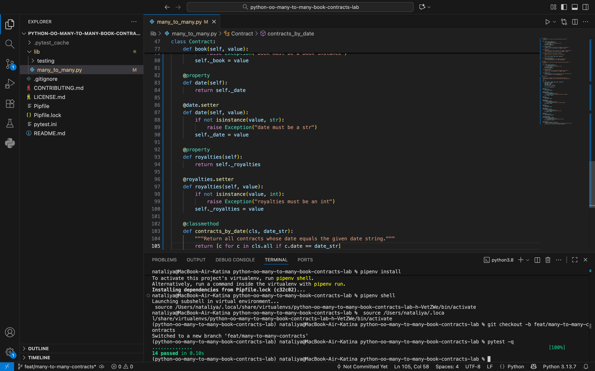

# Many-to-many Object Relationships Lab

Now that we have learned about several types of relationships it's time to build 
one of our own. In this lab you will be creating a many-to many relationship in 
python 

## The Scenario 

We are tasked with building a model to aid in building contracts for books with 
multiple authors. As a part of this model we need to create an Author model, a Book 
model and a Contract model. Authors can have many books through contracts, and books 
can have many authors through contacts.

## Tools & Resources 
- [Github Repo](https://github.com/learn-co-curriculum/python-oo-many-to-many-book-contracts-lab)
- [Python classes](https://docs.python.org/3/tutorial/classes.html)

## Instructions

### Task 1: Define the Problem

Build a model a many to many relationship between Books and Authors:

* Build Book class
* Build Author class
* Build Contract class
* Build connecting methods between all

### Task 2: Determine the Design

#### Book:
* Attributes:
  * title (string)
  * all (array) 
* Methods:
  * contracts()
  * authors()

#### Authors:
* Attributes:
  * name (string)
  * all (array)
* Methods:
  * contracts()
  * books()
  * sign_contracts(book,date,royalties)
  * total_royalties()

#### Contracts:
* Attributes:
  * author (Author class), 
  * book (Book class), 
  * date (string), 
  * royalties (integer)
  * all (array)
* Methods:
  * contracts_by_date()

### Task 3: Develop, Test, and Refine the Code

#### Step 1: Create feature branch

#### Step 2: Create Book class

* `__init__`: title
* Class attributes- all
* Methods:
  * contracts()- This method should return a list of related contracts
  * authors()- This method should return a list of related authors using the Contract class as an intermediary

#### Step 3: Authors

* `__init__`: name (string)
* Class attributes- all
* Methods:
  * contracts()- This method should return a list of related contracts
  * books()- This method should return a list of related books using the Contract class as an intermediary
  * sign_contracts(book,date,royalties)- This method should create and return a new Contract object between the author and the specified book with the specified date and royalties
  * total_royalties()- This method should return the total amount of royalties that the author has earned from all of their contracts

#### Step 4: Contracts

* `__init__`:
  * author
  * book
  * date 
  * royalties 
* Class attributes: all
* Properties: All properties should raise an exception if not valid
  * author: Is an instance of Author class
  * book:  Is an instance of Book class
  * date: Is an instance of a str
  * royalties:  Is an instance of an int
* Class Methods: contracts_by_date()- This method should return all contracts that have the same date as the date passed into the method

#### Step 6: Push feature branch and open a PR on GitHub

#### Step 7: Merge to main

### Task 4: Document and Maintain

Best Practice documentation steps:
* Add comments to the code to explain purpose and logic, clarifying intent and functionality of your code to other developers.
* Update README text to reflect the functionality of the application following https://makeareadme.com. 
  * Add screenshot of completed work included in Markdown in README.
* Delete any stale branches on GitHub
* Remove unnecessary/commented out code
* If needed, update git ignore to remove sensitive data

## Important Submission Note

Before you submit your solution, you need to save your progress with git.

* Add your changes to the staging area by executing git add .
* Create a commit by executing git commit -m "Your commit message"
* Push your commits to GitHub by executing git push origin main

# Many-to-Many Book Contracts

This project models a **many-to-many relationship** between `Author` and `Book` using an intermediary class `Contract`.

---

## Classes

### Author
- Attribute: `name` (string)  
- Class attribute: `Author.all`  
- Methods:  
  - `contracts()` → returns all contracts for this author  
  - `books()` → returns all books by this author  
  - `sign_contract(book, date, royalties)` → creates and returns a new contract  
  - `total_royalties()` → sums all royalties from this author's contracts  

### Book
- Attribute: `title` (string)  
- Class attribute: `Book.all`  
- Methods:  
  - `contracts()` → returns all contracts for this book  
  - `authors()` → returns all authors of this book  

### Contract
- Attributes:  
  - `author` (Author instance)  
  - `book` (Book instance)  
  - `date` (string)  
  - `royalties` (integer)  
- Class attribute: `Contract.all`  
- Method:  
  - `contracts_by_date(date)` → returns all contracts with the same date  

---

## Tests Passed

All automated tests were successfully passed.  
The screenshot below shows the test results:

